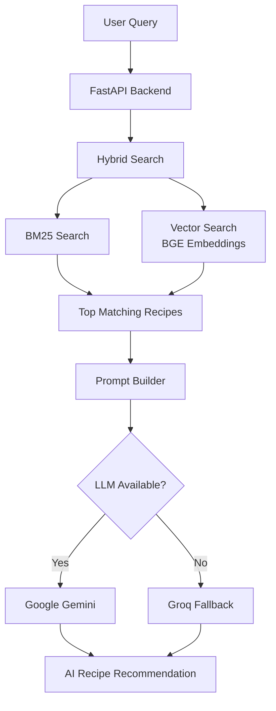

## 🏗 Architecture

```mermaid
flowchart TD

    A[User Query]

    A --> B[FastAPI Backend]

    B --> C[Hybrid Search]

    C --> D1[BM25 Search]
    C --> D2[Vector Search<br/>BGE Embeddings]

    D1 --> E[Top Matching Recipes]
    D2 --> E

    E --> F[Prompt Builder]

    F --> G{LLM Available?}

    G -->|Yes| H[Google Gemini]

    G -->|No| I[Groq Fallback]

    H --> J[AI Recipe Recommendation]

    I --> J
```
